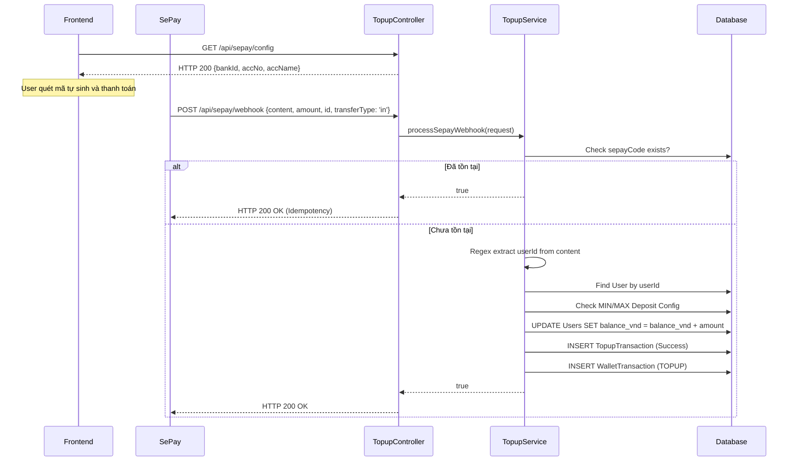

# UC-07 — Nạp Tiền Vào Ví (Wallet Top-up & Webhook)

> **Feature:** `feat-wallet` | **Phiên bản:** 2.0 | **Trạng thái:** Published
> **Tham chiếu FR:** FR-WALL-01 đến FR-WALL-03
> **Cập nhật:** 2026-07-16

---

## 1. Tổng Quan

| Thuộc tính | Nội dung |
|:---|:---|
| **Mã Use Case** | UC-07 |
| **Tên** | Nạp Tiền Vào Ví Qua SePay (Wallet Top-up) |
| **Tác nhân chính** | Người dùng (Customer), SePay Webhook |
| **Mô tả ngắn** | Frontend tự sinh mã VietQR với nội dung chuyển khoản chuyên biệt `MMO TOPUP {userId}`. Khi người dùng thanh toán qua ngân hàng, SePay sẽ gửi Webhook về hệ thống. Backend dùng Regex bóc tách nội dung giao dịch để nhận diện User và tự động cộng số dư vào ví. |
| **Độ ưu tiên** | Cao (P0) — đảm bảo luồng dòng tiền nạp vào hệ thống được thông suốt và chính xác |

---

## 2. Tác Nhân & Điều Kiện

### 2.1 Tác Nhân

| Tác nhân | Vai trò |
|:---|:---|
| **Người dùng (Customer)** | Nhập số tiền, quét mã QR và chuyển khoản đúng nội dung |
| **SePay Webhook** | Gửi HTTP POST báo có giao dịch mới (chuyển tiền tới) qua endpoint webhook |
| **TopupService** | Xử lý bóc tách Regex, cộng tiền và ghi nhận `TopupTransaction`, `WalletTransaction` |

### 2.2 Điều Kiện Tiền Quyết (Preconditions)

- Người dùng đã đăng nhập hệ thống.
- Số dư chuyển vào nằm trong khoảng `MIN_DEPOSIT_LIMIT_VND` (mặc định 10.000 VNĐ) và `MAX_DEPOSIT_LIMIT_VND` (mặc định 50.000.000 VNĐ).

### 2.3 Hậu Điều Kiện (Postconditions)

- **Thành công:** Tiền trong ví của User (`balance_vnd`) tăng thêm bằng số tiền nạp. Hệ thống lưu thành công bản ghi ở bảng `TopupTransaction` (trạng thái Success) và sổ cái ví `WalletTransaction` (loại TOPUP).

---

## 3. Luồng Xử Lý

### 3.1 Luồng Chính — Nạp Tiền Tự Động Bằng VietQR & Webhook

```
Bước 1  [Frontend]:   Truy cập /wallet/topup, gọi GET /api/sepay/config để lấy thông tin Ngân hàng thụ hưởng tĩnh.
Bước 2  [User]:       Nhập số tiền muốn nạp và bấm "Tạo yêu cầu nạp".
Bước 3  [Frontend]:   Tự động sinh chuỗi mã VietQR dựa trên số tiền và cú pháp nội dung là "MMO TOPUP {userId}".
Bước 4  [User]:       Quét mã QR bằng App Ngân hàng và thực hiện chuyển tiền.
Bước 5  [SePay]:      Phát hiện tài khoản ngân hàng thụ hưởng có biến động, gọi Webhook.
Bước 6  [Backend]:    POST /api/sepay/webhook (kèm Header Apikey để xác thực).
Bước 7  [Backend]:    Kiểm tra Authorization Header trùng khớp với `sepay.webhook.token`.
Bước 8  [Backend]:    `TopupService` kiểm tra:
                       - `transferType` phải là "in" (Nạp tiền).
                       - Mã `sepayCode` (ID của webhook) chưa tồn tại trong bảng `TopupTransaction`.
Bước 9  [Backend]:    Bóc tách nội dung chuyển khoản (`content`) bằng Regex `MMO[\s-]*TOPUP[\s-]*(\d+)` để lấy `{userId}`.
Bước 10 [Backend]:    Lấy User từ DB. Kiểm tra số tiền chuyển phải nằm trong giới hạn MIN và MAX.
Bước 11 [Backend]:    Cộng tiền vào `user.balanceVnd`.
Bước 12 [Backend]:    Lưu thông tin giao dịch vào `TopupTransaction` và `WalletTransaction`.
Bước 13 [Backend]:    Trả về HTTP 200 OK để SePay biết đã xử lý thành công.
```

### 3.2 Luồng Phụ — Chống lặp (Idempotency Check)

```
Bước 6  [Backend]:    Nhận Webhook từ SePay.
Bước 8  [Backend]:    Tra cứu mã `sepayCode` (ID) trong bảng `TopupTransaction`. Phát hiện đã tồn tại (do Webhook bị retry hoặc gọi trùng).
Bước 9  [Backend]:    Trả về `true` (Thành công) nhưng KHÔNG thực hiện cộng tiền thêm lần nào nữa, ngăn ngừa nạp đúp tiền.
```

---

## 4. Quy Tắc Nghiệp Vụ (Business Rules)

| Mã | Quy tắc | Chi tiết |
|:---|:---|:---|
| BR-07-01 | Webhook Token | Giao dịch chỉ được chấp nhận nếu header Authorization có chứa chuỗi `"Apikey " + sepayWebhookToken`. Nhân viên/Admin bị cấm gọi API config `GET /api/sepay/config`. |
| BR-07-02 | Định dạng Regex | Bắt buộc phải parse thành công số ID của người dùng từ chuỗi `MMO TOPUP <UserId>` bất kể có khoảng trắng hay dấu gạch nối (`-`). |
| BR-07-03 | Nạp tiền sai cú pháp | Nếu Webhook không khớp Regex, hệ thống bỏ qua và trả về HTTP 400. Admin phải tự xử lý thủ công các giao dịch treo này ngoài hệ thống. |
| BR-07-04 | Hạn mức cấu hình | Check cấu hình `MIN_DEPOSIT_LIMIT_VND` và `MAX_DEPOSIT_LIMIT_VND` trước khi cộng. Vượt quá sẽ từ chối. |

---

## 5. Sơ Đồ Tuần Tự (Sequence Diagram)



---

## 6. Tham Chiếu API

| Phương thức | Endpoint | Mô tả |
|:---|:---|:---|
| `GET` | `/api/sepay/config` | Frontend lấy cấu hình bank để gen QR. (Cấm Role Staff/Admin) |
| `POST` | `/api/sepay/webhook` | Cổng nhận webhook từ SePay khi có biến động số dư |
