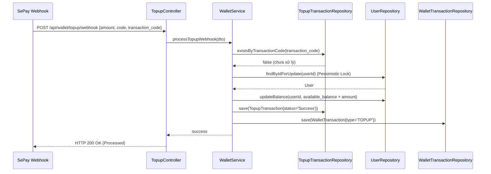

# UC-07 — Nạp Tiền Vào Ví (Wallet Top-up)

> **Feature:** `feat-wallet` | **Phiên bản:** 1.0 | **Trạng thái:** Published
> **Tham chiếu FR:** FR-WALL-01 đến FR-WALL-03
> **Cập nhật:** 2026-06-30

---

## 1. Tổng Quan

| Thuộc tính | Nội dung |
|:---|:---|
| **Mã Use Case** | UC-07 |
| **Tên** | Nạp Tiền Vào Ví (Wallet Top-up) |
| **Tác nhân chính** | Người dùng (Customer), SePay Webhook |
| **Mô tả ngắn** | Người dùng yêu cầu nạp tiền, hệ thống sinh mã VietQR động. Khi người dùng chuyển tiền thành công, cổng thanh toán SePay gửi Webhook đến hệ thống để tự động xác thực giao dịch chuyển tiền và cộng số dư khả dụng cho ví của người dùng. |
| **Độ ưu tiên** | Cao (P0) — đảm bảo luồng dòng tiền nạp vào hệ thống được thông suốt và chính xác |

---

## 2. Tác Nhân & Điều Kiện

### 2.1 Tác Nhân

| Tác nhân | Vai trò |
|:---|:---|
| **Người dùng (Customer)** | Nhập số tiền nạp, quét mã VietQR và thực hiện chuyển khoản |
| **SePay Webhook** | Gửi thông tin giao dịch ngân hàng thực tế về hệ thống |
| **WalletService** | Xử lý tăng số dư và ghi nhận lịch sử giao dịch ví |

### 2.2 Điều Kiện Tiền Quyết (Preconditions)

- Người dùng đã đăng nhập hệ thống và tài khoản đã xác thực OTP email.
- Số tiền nạp tối thiểu đạt mức quy định (ví dụ: 10,000 VNĐ).

### 2.3 Hậu Điều Kiện (Postconditions)

- **Thành công:** `available_balance` của User tăng thêm bằng đúng số tiền nạp, tạo bản ghi `TopupTransactions` và `WalletTransactions` với trạng thái thành công.

---

## 3. Luồng Xử Lý

### 3.1 Luồng Chính — Nạp Tiền Tự Động Qua QR (Happy Path)

```
Bước 1  [Customer]:   Vào trang Ví cá nhân, chọn "Nạp tiền"
Bước 2  [Frontend]:   Hiển thị ô nhập số tiền nạp
Bước 3  [Customer]:   Nhập số tiền (ví dụ: 100,000 VNĐ) và bấm "Tạo mã QR"
Bước 4  [Frontend]:   POST /api/wallet/topup/request { amount }
Bước 5  [Backend]:    Tạo mã giao dịch tạm thời (ví dụ: "MMO12345") liên kết với userId
                       Tạo URL VietQR động theo cấu trúc định dạng SePay
                       Trả về: status = 200, qrUrl, transferCode, amount
Bước 6  [Frontend]:   Hiển thị mã VietQR động và hướng dẫn chuyển khoản
Bước 7  [Customer]:   Dùng ứng dụng ngân hàng quét mã QR, thực hiện chuyển tiền
Bước 8  [SePay]:      Ngân hàng báo có, SePay phát hiện biến động số dư và gửi Webhook
Bước 9  [Backend]:    POST /api/wallet/topup/webhook (chứa mã giao dịch, số tiền, nội dung)
Bước 10 [Backend]:    Validate API Key/Signature của SePay Webhook
                       Validate Idempotence: kiểm tra transaction_code trong DB xem đã được xử lý chưa
                       Nếu chưa xử lý:
                         - Tìm User liên kết dựa trên mã nội dung chuyển khoản ("MMO12345")
                         - @Transactional:
                           - Khóa Pessimistic Lock thông tin User để chống race condition
                           - Cập nhật User.availableBalance = User.availableBalance + amount
                           - Lưu TopupTransactions (status = 'Success')
                           - Lưu WalletTransactions (type = 'TOPUP')
                           - Tạo thông báo số dư thành công gửi cho User
                       Trả về HTTP 200 OK cho SePay Webhook
Bước 11 [Frontend]:   (Sử dụng WebSocket hoặc Polling) Nhận được tin nhắn cập nhật số dư, hiển thị thông báo nạp thành công
```

### 3.2 Luồng Phụ A — Webhook Gửi Trùng (Idempotency)

```
Bước 9  [Backend]:    Nhận cuộc gọi webhook lần 2 cho cùng mã giao dịch đã xử lý trước đó
Bước 10 [Backend]:    Kiểm tra DB thấy mã giao dịch đã có trạng thái 'Success'
                       Hệ thống bỏ qua không cộng tiền lần nữa (Idempotency)
                       Trả về HTTP 200 OK ngay lập tức để báo SePay dừng gửi lại
```

---

## 4. Quy Tắc Nghiệp Vụ

| Mã | Quy tắc | Chi tiết |
|:---|:---|:---|
| BR-07-01 | Số dư dạng BIGINT | Toàn bộ tính toán tiền tệ và lưu trữ phải dùng kiểu số nguyên lớn (VNĐ), không dùng số thực |
| BR-07-02 | Khóa Pessimistic Lock | Khi cộng số dư khả dụng, bắt buộc thực hiện Pessimistic Lock hàng dữ liệu user để tránh lỗi ghi đè đồng thời |
| BR-07-03 | Kiểm tra mã giao dịch duy nhất | Mã giao dịch từ SePay Webhook phải được kiểm tra tính duy nhất để tránh lỗi nạp đúp tiền |

---

## 5. Quy Tắc Kiểm Tra Đầu Vào

### POST /api/wallet/topup/request

| Trường | Kiểm tra | Lỗi khi vi phạm |
|:---|:---|:---|
| `amount` | Bắt buộc, số nguyên, `>= 10000` | "Số tiền nạp tối thiểu là 10,000 VNĐ" |

---

## 6. Sơ Đồ Tuần Tự (Sequence Diagram)

### Luồng Xử Lý Webhook Nạp Tiền



---

## 7. Tham Chiếu API

| Phương thức | Endpoint | Mô tả |
|:---|:---|:---|
| `POST` | `/api/wallet/topup/request` | Yêu cầu mã QR nạp tiền |
| `POST` | `/api/wallet/topup/webhook` | Cổng tiếp nhận Webhook SePay |

---

## 8. Tiêu Chí Chấp Nhận (Acceptance Criteria)

### AC-07-01 — Không nạp đúp tiền khi SePay gọi Webhook nhiều lần

- **Cho trước:** Giao dịch nạp tiền mã `TX999` trị giá 100,000đ đã được xử lý cộng tiền thành công cho tài khoản `User C`
- **Khi:** SePay gửi lại POST `/api/wallet/topup/webhook` cho giao dịch `TX999` lần thứ hai
- **Thì:**
  - Hệ thống không cộng thêm tiền vào tài khoản `User C`
  - Hệ thống trả về HTTP 200 OK phản hồi thành công

---

## 9. Ngoài Phạm Vi (Out of Scope)

- ❌ Nạp tiền bằng thẻ cào điện thoại.
- ❌ Nạp tiền bằng tin nhắn SMS.
