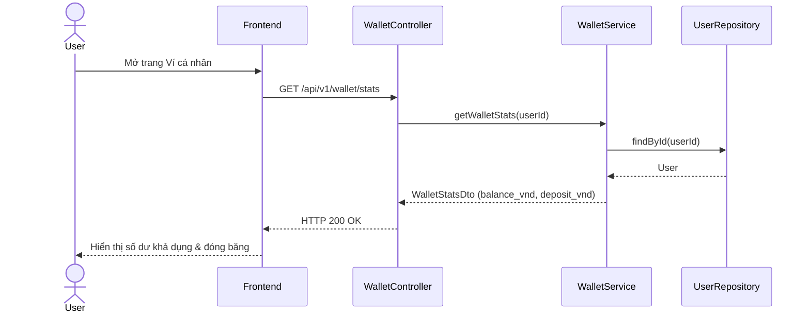

# UC-16 — Xem Số Dư & Thống Kê Ví (View Wallet Balance & Stats)

> **Feature:** `feat-wallet` | **Phiên bản:** 2.0 | **Trạng thái:** Published
> **Tham chiếu FR:** FR-WALLET-01 đến FR-WALLET-12
> **Cập nhật:** 2026-07-24

---

## 1. Tổng Quan

| Thuộc tính | Nội dung |
|:---|:---|
| **Mã Use Case** | UC-16 |
| **Tên** | Xem Số Dư & Thống Kê Ví (View Wallet Balance & Stats) |
| **Tác nhân chính** | Người dùng (User) |
| **Mô tả ngắn** | Người dùng xem số dư khả dụng (balance_vnd), số dư đóng băng (deposit_vnd) và thống kê dòng tiền. |
| **Độ ưu tiên** | Cao (P0) |

---

## 2. Tác Nhân & Điều Kiện

### 2.1 Tác Nhân
| Tác nhân | Vai trò |
|:---|:---|
| **Người dùng (User)** | Tác nhân chính thực hiện nghiệp vụ của hệ thống. |

### 2.2 Điều Kiện Tiền Quyết (Preconditions)
- Người dùng đã đăng nhập hệ thống.

### 2.3 Hậu Điều Kiện (Postconditions)
- **Thành công:** Thông tin số dư hiển thị chính xác.
- **Thất bại:** Trạng thái database không đổi, hệ thống trả về mã lỗi chi tiết.

---

## 3. Luồng Xử Lý (Sequence Steps)

### 3.1 Luồng Chính (Happy Path)
Bước 1 [User]:       Truy cập vào trang "Ví của tôi".
Bước 2 [Frontend]:   Gửi yêu cầu GET /api/v1/wallet/stats.
Bước 3 [Backend]:    WalletController gọi WalletService.getWalletStats().
                       - Đọc thông tin balance_vnd và deposit_vnd từ DB của User.
Bước 4 [Backend]:    Trả về WalletStatsDto.
Bước 5 [Frontend]:   Hiển thị số dư khả dụng và đóng băng phân cách hàng nghìn VNĐ trên UI.

### 3.2 Luồng Lỗi (Error Path)
| Tình huống | HTTP | Error Code | Xử lý |
|:---|:---:|:---|:---|
| Chưa đăng nhập | 401 | `UNAUTHORIZED` | Ngăn chặn hiển thị thông tin ví |

---

## 4. Quy Tắc Nghiệp Vụ (Business Rules)

| Mã | Quy tắc | Chi tiết |
|:---|:---|:---|
| BR-16-01 | Tách biệt trạng thái số dư | Bắt buộc hiển thị rõ hai trạng thái balance_vnd (sử dụng được) và deposit_vnd (bị đóng băng) |

---

## 5. Quy Tắc Kiểm Tra Đầu Vào

| Trường | Kiểm tra | Thông báo lỗi nếu sai |
|:---|:---|:---|
| None | | |

---

## 6. Sơ Đồ Tuần Tự (Sequence Diagram)

---

## 7. Tham Chiếu API

| Phương thức | Endpoint | Mô tả |
|:---|:---|:---|
| GET | `/api/v1/wallet/stats` | Xem số dư ví và thống kê tài chính |

---

## 8. Tiêu Chỉ Chấp Nhận (Acceptance Criteria)

### AC-16-01 — Xem số dư ví thành công
> **Tham chiếu:** FR-WAL-01
- **Cho trước:** Tài khoản có 500k khả dụng và 200k đóng băng.
- **Khi:** Truy cập vào trang ví.
- **Thì:** Hiển thị chính xác số dư tương ứng.

---

## 9. Ngoài Phạm Vi (Out of Scope)
- ❌ Xem thông tin dòng tiền chi tiết của tài khoản khác.

---

## 10. Danh Sách SRS Use Cases Hạt Nhân Trực Thuộc (SRS Mapping)

| SRS UC ID | Tên Use Case SRS | Feature Module | Mô Tả Chức Năng Chi Tiết |
|:---|:---|:---|:---|
| **UC 16** | View Wallet Balance & Stats | feat-wallet | Người dùng xem số dư khả dụng (balance_vnd), số dư đóng băng (deposit_vnd) và thống kê dòng tiền. |
