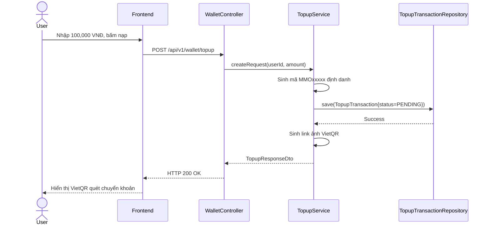

# UC-17 — Yêu Cầu Nạp Tiền Qua VietQR (Request Top-Up money via VietQR)

> **Feature:** `feat-wallet` | **Phiên bản:** 2.0 | **Trạng thái:** Published
> **Tham chiếu FR:** FR-WALLET-01 đến FR-WALLET-12
> **Cập nhật:** 2026-07-24

---

## 1. Tổng Quan

| Thuộc tính | Nội dung |
|:---|:---|
| **Mã Use Case** | UC-17 |
| **Tên** | Yêu Cầu Nạp Tiền Qua VietQR (Request Top-Up money via VietQR) |
| **Tác nhân chính** | Người dùng (User) |
| **Mô tả ngắn** | Người dùng tạo yêu cầu nạp tiền vào ví, sinh mã chuyển khoản định danh và mã VietQR chuẩn. |
| **Độ ưu tiên** | Cao (P0) |

---

## 2. Tác Nhân & Điều Kiện

### 2.1 Tác Nhân
| Tác nhân | Vai trò |
|:---|:---|
| **Người dùng (User)** | Tác nhân chính thực hiện nghiệp vụ của hệ thống. |

### 2.2 Điều Kiện Tiền Quyết (Preconditions)
- Người dùng đã đăng nhập hệ thống.

### 2.3 Hậu Điều Kiện (Postconditions)
- **Thành công:** Bản ghi TopupTransaction trạng thái PENDING được tạo thành công.
- **Thất bại:** Trạng thái database không đổi, hệ thống trả về mã lỗi chi tiết.

---

## 3. Luồng Xử Lý (Sequence Steps)

### 3.1 Luồng Chính (Happy Path)
Bước 1 [User]:       Nhập số tiền nạp, bấm "Tạo mã nạp tiền".
Bước 2 [Frontend]:   Gửi yêu cầu POST /api/v1/wallet/topup { "amountVnd": 100000 }.
Bước 3 [Backend]:    WalletController nhận request, gọi TopupService.createTopupRequest().
                       - Sinh nội dung chuyển khoản duy nhất MMOxxxxx.
                       - Tạo TopupTransaction ở trạng thái PENDING.
                       - Tạo link ảnh QR VietQR chuẩn ngân hàng chứa mã nội dung.
Bước 4 [Backend]:    Trả về thông tin nạp tiền và QR Code.
Bước 5 [Frontend]:   Hiển thị mã QR và thông tin chuyển khoản ngân hàng.

### 3.2 Luồng Lỗi (Error Path)
| Tình huống | HTTP | Error Code | Xử lý |
|:---|:---:|:---|:---|
| Số tiền nạp dưới 10k | 400 | `VALIDATION_FAILED` | Báo lỗi số tiền nạp không hợp lệ |

---

## 4. Quy Tắc Nghiệp Vụ (Business Rules)

| Mã | Quy tắc | Chi tiết |
|:---|:---|:---|
| BR-17-01 | Số tiền nạp tối thiểu | Số tiền nạp tối thiểu mỗi giao dịch là 10,000 VNĐ |

---

## 5. Quy Tắc Kiểm Tra Đầu Vào

| Trường | Kiểm tra | Thông báo lỗi nếu sai |
|:---|:---|:---|
| `amountVnd` | Bắt buộc, tối thiểu 10000 | "Số tiền nạp tối thiểu là 10,000 VNĐ" |

---

## 6. Sơ Đồ Tuần Tự (Sequence Diagram)

---

## 7. Tham Chiếu API

| Phương thức | Endpoint | Mô tả |
|:---|:---|:---|
| POST | `/api/v1/wallet/topup` | Khởi tạo giao dịch nạp tiền ví |

---

## 8. Tiêu Chỉ Chấp Nhận (Acceptance Criteria)

### AC-17-01 — Khởi tạo yêu cầu nạp thành công
> **Tham chiếu:** FR-WAL-02
- **Cho trước:** Đăng nhập tài khoản.
- **Khi:** Yêu cầu nạp 100,000 VNĐ.
- **Thì:** Tạo giao dịch nạp PENDING và trả về đúng link ảnh VietQR.

---

## 9. Ngoài Phạm Vi (Out of Scope)
- ❌ Tự động nạp tiền bằng thẻ tín dụng trực tiếp.

---

## 10. Danh Sách SRS Use Cases Hạt Nhân Trực Thuộc (SRS Mapping)

| SRS UC ID | Tên Use Case SRS | Feature Module | Mô Tả Chức Năng Chi Tiết |
|:---|:---|:---|:---|
| **UC 17** | Request Top-Up money via VietQR | feat-wallet | Người dùng tạo yêu cầu nạp tiền vào ví, sinh mã chuyển khoản định danh và mã VietQR chuẩn. |
