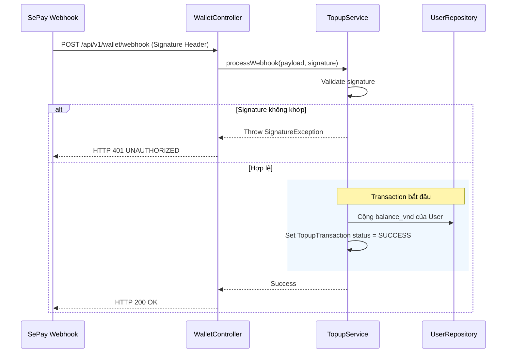

# UC-18 — Xử Lý Callback Nạp Tiền Tự Động (Response Top-Up money via SePay)

> **Feature:** `feat-wallet` | **Phiên bản:** 2.0 | **Trạng thái:** Published
> **Tham chiếu FR:** FR-WALLET-01 đến FR-WALLET-12
> **Cập nhật:** 2026-07-24

---

## 1. Tổng Quan

| Thuộc tính | Nội dung |
|:---|:---|
| **Mã Use Case** | UC-18 |
| **Tên** | Xử Lý Callback Nạp Tiền Tự Động (Response Top-Up money via SePay) |
| **Tác nhân chính** | Hệ thống (System) / SePay Webhook |
| **Mô tả ngắn** | Xử lý callback tự động từ SePay để cộng tiền khả dụng cho người dùng ngay khi có biến động số dư ngân hàng. |
| **Độ ưu tiên** | Cao (P0) |

---

## 2. Tác Nhân & Điều Kiện

### 2.1 Tác Nhân
| Tác nhân | Vai trò |
|:---|:---|
| **Hệ thống (System) / SePay Webhook** | Tác nhân chính thực hiện nghiệp vụ của hệ thống. |

### 2.2 Điều Kiện Tiền Quyết (Preconditions)
- Nhận được IP/Signature Webhook hợp lệ từ cổng thanh toán SePay.

### 2.3 Hậu Điều Kiện (Postconditions)
- **Thành công:** Ví người dùng được cộng tiền khả dụng, giao dịch nạp chuyển sang trạng thái SUCCESS.
- **Thất bại:** Trạng thái database không đổi, hệ thống trả về mã lỗi chi tiết.

---

## 3. Luồng Xử Lý (Sequence Steps)

### 3.1 Luồng Chính (Happy Path)
Bước 1 [SePay]:      Gửi POST request chứa thông tin chuyển khoản thành công đến Webhook API.
Bước 2 [Backend]:    WalletController tiếp nhận, gọi TopupService.processWebhook().
                       - Kiểm tra và xác thực chữ ký signature.
                       - Phân tích nội dung chuyển khoản để tìm MMOxxxxx tương ứng.
                       @Transactional:
                         - Khóa dòng tiền nạp tiền của User.
                         - Cộng tiền khả dụng: balance_vnd = balance_vnd + amount.
                         - Cập nhật trạng thái TopupTransaction sang SUCCESS.
Bước 3 [Backend]:    Trả về HTTP 200 OK.
Bước 4 [Frontend]:   Nhận thông báo nạp thành công qua Server-Sent Events (SSE) và cập nhật số dư tức thời.

### 3.2 Luồng Lỗi (Error Path)
| Tình huống | HTTP | Error Code | Xử lý |
|:---|:---:|:---|:---|
| Sai chữ ký bảo mật | 401 | `UNAUTHORIZED` | Từ chối xử lý webhook giả mạo |
| Giao dịch đã xử lý | 200 | `TRANSACTION_ALREADY_PROCESSED` | Bỏ qua không cộng tiền lần 2 |

---

## 4. Quy Tắc Nghiệp Vụ (Business Rules)

| Mã | Quy tắc | Chi tiết |
|:---|:---|:---|
| BR-18-01 | Idempotency | Tuyệt đối không xử lý lại các giao dịch nạp tiền đã ở trạng thái SUCCESS |
| BR-18-02 | Validate Signature | Bắt buộc kiểm tra signature bảo mật để chống việc giả lập request nạp tiền khống |

---

## 5. Quy Tắc Kiểm Tra Đầu Vào

| Trường | Kiểm tra | Thông báo lỗi nếu sai |
|:---|:---|:---|
| Webhook Payload | Bắt buộc | "Payload không hợp lệ" |

---

## 6. Sơ Đồ Tuần Tự (Sequence Diagram)

---

## 7. Tham Chiếu API

| Phương thức | Endpoint | Mô tả |
|:---|:---|:---|
| POST | `/api/v1/wallet/webhook` | Webhook tiếp nhận callback nạp tiền tự động từ SePay |

---

## 8. Tiêu Chỉ Chấp Nhận (Acceptance Criteria)

### AC-18-01 — Xử lý nạp tiền webhook thành công
> **Tham chiếu:** FR-WAL-04
- **Cho trước:** Lệnh nạp MMO12345 đang PENDING.
- **Khi:** SePay gửi callback đúng định danh MMO12345.
- **Thì:** Ví khả dụng của người dùng được cộng đúng số tiền và trạng thái chuyển sang SUCCESS.

---

## 9. Ngoài Phạm Vi (Out of Scope)
- ❌ Xử lý hoàn tiền tự động khi người dùng nạp tiền sai cú pháp.

---

## 10. Danh Sách SRS Use Cases Hạt Nhân Trực Thuộc (SRS Mapping)

| SRS UC ID | Tên Use Case SRS | Feature Module | Mô Tả Chức Năng Chi Tiết |
|:---|:---|:---|:---|
| **UC 18** | Response Top-Up money via SePay | feat-wallet | Xử lý callback tự động từ SePay để cộng tiền khả dụng cho người dùng ngay khi có biến động số dư ngân hàng. |
