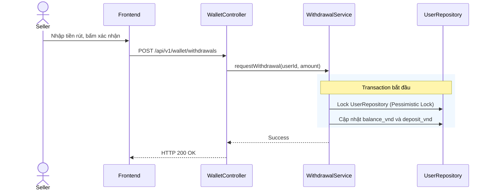

# UC-19 — Yêu Cầu Rút Tiền (Request Withdrawal)

> **Feature:** `feat-wallet` | **Phiên bản:** 2.0 | **Trạng thái:** Published
> **Tham chiếu FR:** FR-WALLET-01 đến FR-WALLET-12
> **Cập nhật:** 2026-07-24

---

## 1. Tổng Quan

| Thuộc tính | Nội dung |
|:---|:---|
| **Mã Use Case** | UC-19 |
| **Tên** | Yêu Cầu Rút Tiền (Request Withdrawal) |
| **Tác nhân chính** | Người bán (Seller) |
| **Mô tả ngắn** | Seller gửi yêu cầu rút tiền từ số dư khả dụng (balance_vnd) về tài khoản ngân hàng thụ hưởng. |
| **Độ ưu tiên** | Cao (P0) |

---

## 2. Tác Nhân & Điều Kiện

### 2.1 Tác Nhân
| Tác nhân | Vai trò |
|:---|:---|
| **Người bán (Seller)** | Tác nhân chính thực hiện nghiệp vụ của hệ thống. |

### 2.2 Điều Kiện Tiền Quyết (Preconditions)
- Số dư khả dụng balance_vnd >= số tiền rút. Tài khoản không bị khóa rút tiền.

### 2.3 Hậu Điều Kiện (Postconditions)
- **Thành công:** Số dư khả dụng bị trừ, số dư tạm khóa deposit_vnd tăng lên tương ứng. Tạo lệnh rút PENDING.
- **Thất bại:** Trạng thái database không đổi, hệ thống trả về mã lỗi chi tiết.

---

## 3. Luồng Xử Lý (Sequence Steps)

### 3.1 Luồng Chính (Happy Path)
Bước 1 [Seller]:    Nhập số tiền cần rút và chọn tài khoản ngân hàng liên kết, bấm "Xác nhận rút tiền".
Bước 2 [Frontend]:  Gửi yêu cầu POST /api/v1/wallet/withdrawals.
Bước 3 [Backend]:   WalletController gọi WithdrawalService.requestWithdrawal().
                     @Transactional:
                       - Khóa bi quan UserRepository ví Seller.
                       - Kiểm tra: balance_vnd >= amountVnd và withdrawal_locked == false.
                       - Khấu trừ balance_vnd và cộng vào deposit_vnd (đóng băng).
                       - Tạo bản ghi trong bảng Withdrawals trạng thái PENDING.
Bước 4 [Backend]:   Trả về HTTP 200 OK.
Bước 5 [Frontend]:   Hiển thị thông báo rút tiền đang chờ xử lý và cập nhật lại số dư ví.

### 3.2 Luồng Lỗi (Error Path)
| Tình huống | HTTP | Error Code | Xử lý |
|:---|:---:|:---|:---|
| Số dư không đủ | 422 | `INSUFFICIENT_BALANCE` | Từ chối tạo lệnh rút tiền |
| Tính năng bị khóa | 403 | `WITHDRAWAL_LOCKED` | Chặn yêu cầu rút tiền do shop vi phạm |

---

## 4. Quy Tắc Nghiệp Vụ (Business Rules)

| Mã | Quy tắc | Chi tiết |
|:---|:---|:---|
| BR-19-01 | Rút tối thiểu | Số tiền rút tối thiểu mỗi lần là 50,000 VNĐ |

---

## 5. Quy Tắc Kiểm Tra Đầu Vào

| Trường | Kiểm tra | Thông báo lỗi nếu sai |
|:---|:---|:---|
| `amountVnd` | Bắt buộc, tối thiểu 50000 | "Số tiền rút tối thiểu là 50,000 VNĐ" |

---

## 6. Sơ Đồ Tuần Tự (Sequence Diagram)

---

## 7. Tham Chiếu API

| Phương thức | Endpoint | Mô tả |
|:---|:---|:---|
| POST | `/api/v1/wallet/withdrawals` | Gửi yêu cầu rút tiền |

---

## 8. Tiêu Chỉ Chấp Nhận (Acceptance Criteria)

### AC-19-01 — Tạo yêu cầu rút tiền thành công
> **Tham chiếu:** FR-WAL-05
- **Cho trước:** Seller có 500,000 VNĐ khả dụng.
- **Khi:** Yêu cầu rút 100,000 VNĐ.
- **Thì:** Ví khả dụng còn 400,000 VNĐ, ví đóng băng tăng 100,000 VNĐ.

---

## 9. Ngoài Phạm Vi (Out of Scope)
- ❌ Tự động chuyển khoản ngân hàng qua cổng API thụ động.

---

## 10. Danh Sách SRS Use Cases Hạt Nhân Trực Thuộc (SRS Mapping)

| SRS UC ID | Tên Use Case SRS | Feature Module | Mô Tả Chức Năng Chi Tiết |
|:---|:---|:---|:---|
| **UC 19** | Request Withdrawal | feat-wallet | Seller gửi yêu cầu rút tiền từ số dư khả dụng (balance_vnd) về tài khoản ngân hàng thụ hưởng. |
