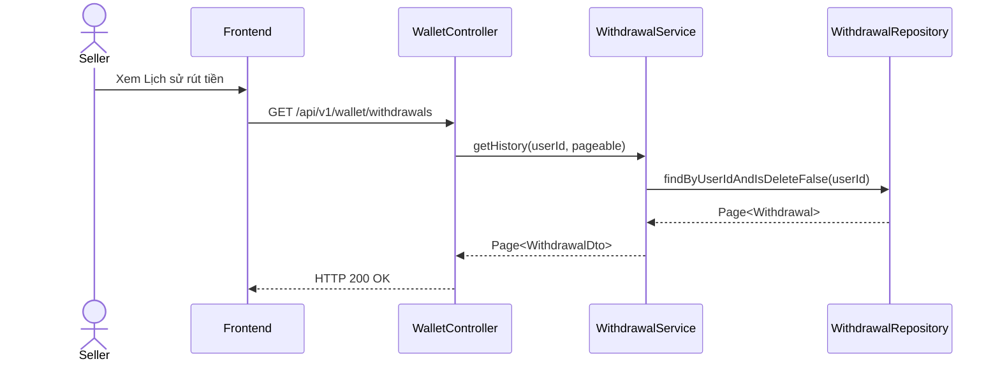

# UC-20 — Xem Lịch Sử Rút Tiền (View Withdrawal History)

> **Feature:** `feat-wallet` | **Phiên bản:** 2.0 | **Trạng thái:** Published
> **Tham chiếu FR:** FR-WALLET-01 đến FR-WALLET-12
> **Cập nhật:** 2026-07-24

---

## 1. Tổng Quan

| Thuộc tính | Nội dung |
|:---|:---|
| **Mã Use Case** | UC-20 |
| **Tên** | Xem Lịch Sử Rút Tiền (View Withdrawal History) |
| **Tác nhân chính** | Người bán (Seller) |
| **Mô tả ngắn** | Seller xem danh sách các yêu cầu rút tiền đã tạo và trạng thái xử lý tương ứng. |
| **Độ ưu tiên** | Trung bình (P1) |

---

## 2. Tác Nhân & Điều Kiện

### 2.1 Tác Nhân
| Tác nhân | Vai trò |
|:---|:---|
| **Người bán (Seller)** | Tác nhân chính thực hiện nghiệp vụ của hệ thống. |

### 2.2 Điều Kiện Tiền Quyết (Preconditions)
- Người bán đã đăng nhập hệ thống.

### 2.3 Hậu Điều Kiện (Postconditions)
- **Thành công:** Danh sách lịch sử rút tiền hiển thị thành công.
- **Thất bại:** Trạng thái database không đổi, hệ thống trả về mã lỗi chi tiết.

---

## 3. Luồng Xử Lý (Sequence Steps)

### 3.1 Luồng Chính (Happy Path)
Bước 1 [Seller]:    Vào giao diện quản trị, chọn mục "Lịch sử rút tiền".
Bước 2 [Frontend]:  Gửi yêu cầu GET /api/v1/wallet/withdrawals.
Bước 3 [Backend]:   WalletController gọi WithdrawalService.getWithdrawalsBySeller().
                     - Truy vấn bảng Withdrawals có isDelete = 0 lọc theo sellerId.
Bước 4 [Backend]:   Trả về Page DTO.
Bước 5 [Frontend]:   Render danh sách lịch sử rút tiền kèm trạng thái và ghi chú.

### 3.2 Luồng Lỗi (Error Path)
| Tình huống | HTTP | Error Code | Xử lý |
|:---|:---:|:---|:---|
| Lỗi kết nối DB | 500 | `INTERNAL_SERVER_ERROR` | Hiển thị lỗi hệ thống |

---

## 4. Quy Tắc Nghiệp Vụ (Business Rules)

| Mã | Quy tắc | Chi tiết |
|:---|:---|:---|
| BR-20-01 | Lọc mềm | Bắt buộc lọc các dòng dữ liệu có cờ isDelete = 0 |

---

## 5. Quy Tắc Kiểm Tra Đầu Vào

| Trường | Kiểm tra | Thông báo lỗi nếu sai |
|:---|:---|:---|
| `page` | Tùy chọn, số nguyên | "Page không hợp lệ" |

---

## 6. Sơ Đồ Tuần Tự (Sequence Diagram)

---

## 7. Tham Chiếu API

| Phương thức | Endpoint | Mô tả |
|:---|:---|:---|
| GET | `/api/v1/wallet/withdrawals` | Xem lịch sử các yêu cầu rút tiền |

---

## 8. Tiêu Chỉ Chấp Nhận (Acceptance Criteria)

### AC-20-01 — Xem lịch sử thành công
> **Tham chiếu:** FR-WAL-06
- **Cho trước:** Có 2 yêu cầu rút tiền.
- **Khi:** Truy cập vào trang lịch sử.
- **Thì:** Hiển thị đúng danh sách trạng thái của 2 lệnh nạp/rút.

---

## 9. Ngoài Phạm Vi (Out of Scope)
- ❌ Hủy bỏ yêu cầu rút tiền đang ở trạng thái PENDING.

---

## 10. Danh Sách SRS Use Cases Hạt Nhân Trực Thuộc (SRS Mapping)

| SRS UC ID | Tên Use Case SRS | Feature Module | Mô Tả Chức Năng Chi Tiết |
|:---|:---|:---|:---|
| **UC 20** | View Withdrawal History | feat-wallet | Seller xem danh sách các yêu cầu rút tiền đã tạo và trạng thái xử lý tương ứng. |
