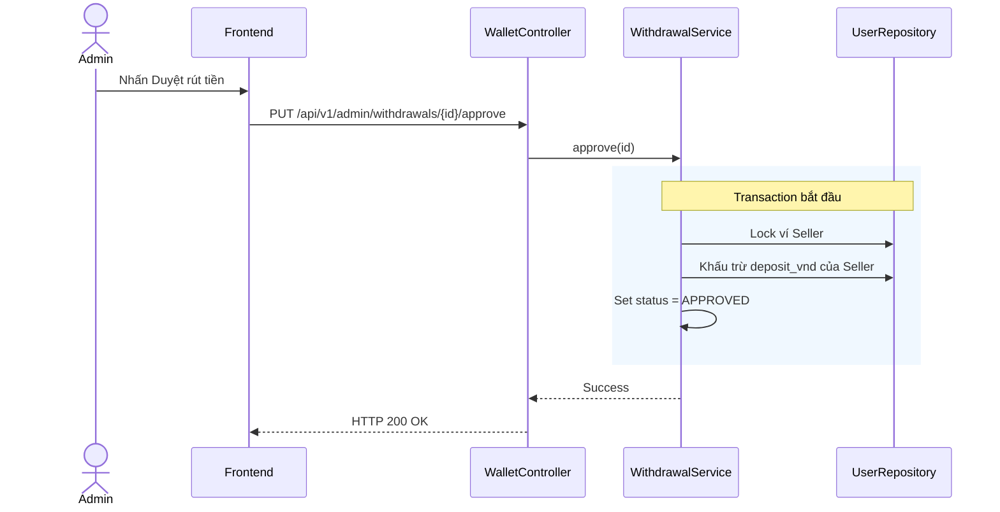

# UC-30 — Phê Duyệt/Từ Chối Yêu Cầu Rút Tiền (Approve/Reject Withdrawal Requests)

> **Feature:** `feat-wallet` | **Phiên bản:** 2.0 | **Trạng thái:** Published
> **Tham chiếu FR:** FR-WALLET-01 đến FR-WALLET-12
> **Cập nhật:** 2026-07-24

---

## 1. Tổng Quan

| Thuộc tính | Nội dung |
|:---|:---|
| **Mã Use Case** | UC-30 |
| **Tên** | Phê Duyệt/Từ Chối Yêu Cầu Rút Tiền (Approve/Reject Withdrawal Requests) |
| **Tác nhân chính** | Quản trị viên (Admin) / Nhân viên (Staff) |
| **Mô tả ngắn** | Admin/Staff phê duyệt yêu cầu rút tiền sau khi đã chuyển khoản thành công bên ngoài, hoặc từ chối yêu cầu và hoàn tiền về ví cho Seller. |
| **Độ ưu tiên** | Cao (P0) |

---

## 2. Tác Nhân & Điều Kiện

### 2.1 Tác Nhân
| Tác nhân | Vai trò |
|:---|:---|
| **Quản trị viên (Admin) / Nhân viên (Staff)** | Tác nhân chính thực hiện nghiệp vụ của hệ thống. |

### 2.2 Điều Kiện Tiền Quyết (Preconditions)
- Lệnh rút tiền (Withdrawal) ở trạng thái PENDING. Admin/Staff đã xác thực.

### 2.3 Hậu Điều Kiện (Postconditions)
- **Thành công:** Lệnh rút chuyển sang APPROVED hoặc REJECTED, ví đóng băng tương ứng được khấu trừ hoặc hoàn lại.
- **Thất bại:** Trạng thái database không đổi, hệ thống trả về mã lỗi chi tiết.

---

## 3. Luồng Xử Lý (Sequence Steps)

### 3.1 Luồng Chính (Happy Path)
Bước 1 [Admin/Staff]: Xem danh sách lệnh rút PENDING, chuyển khoản ngân hàng thực tế bên ngoài.
Bước 2 [Admin/Staff]: Bấm "Phê duyệt" (hoặc "Từ chối" nhập lý do).
Bước 3 [Frontend]:   Gửi yêu cầu PUT /api/v1/admin/withdrawals/{id}/approve (hoặc /reject).
Bước 4 [Backend]:    WalletController nhận request, gọi WithdrawalService.approveWithdrawal() hoặc rejectWithdrawal().
                       @Transactional:
                         - Khóa ví Seller.
                         - Nếu APPROVE:
                           - Khấu trừ số tiền rút khỏi deposit_vnd (ví đóng băng) của Seller.
                         - Nếu REJECT:
                           - Trừ tiền deposit_vnd và trả về balance_vnd (ví khả dụng) của Seller.
                         - Cập nhật trạng thái lệnh rút tiền.
                         - Ghi log AuditLog.
Bước 5 [Backend]:    Trả về HTTP 200 OK.
Bước 6 [Frontend]:   Cập nhật trạng thái lệnh rút tiền trên UI.

### 3.2 Luồng Lỗi (Error Path)
| Tình huống | HTTP | Error Code | Xử lý |
|:---|:---:|:---|:---|
| Lệnh rút không ở PENDING | 400 | `INVALID_WITHDRAWAL_STATUS` | Từ chối xử lý duyệt trùng |

---

## 4. Quy Tắc Nghiệp Vụ (Business Rules)

| Mã | Quy tắc | Chi tiết |
|:---|:---|:---|
| BR-30-01 | Lưu vết kiểm toán | Mọi lệnh rút tiền được duyệt hoặc từ chối bắt buộc phải ghi nhận AuditLog chi tiết |

---

## 5. Quy Tắc Kiểm Tra Đầu Vào

| Trường | Kiểm tra | Thông báo lỗi nếu sai |
|:---|:---|:---|
| `id` | Bắt buộc | "ID yêu cầu rút tiền không được trống" |

---

## 6. Sơ Đồ Tuần Tự (Sequence Diagram)

---

## 7. Tham Chiếu API

| Phương thức | Endpoint | Mô tả |
|:---|:---|:---|
| PUT | `/api/v1/admin/withdrawals/{id}/approve` | Phê duyệt lệnh rút tiền |
| PUT | `/api/v1/admin/withdrawals/{id}/reject` | Từ chối lệnh rút tiền |

---

## 8. Tiêu Chỉ Chấp Nhận (Acceptance Criteria)

### AC-30-01 — Phê duyệt lệnh rút tiền thành công
> **Tham chiếu:** FR-WAL-07
- **Cho trước:** Lệnh rút 100,000 VNĐ đang PENDING. Số dư đóng băng của Seller là 100,000 VNĐ.
- **Khi:** Admin duyệt rút tiền thành công.
- **Thì:** Số dư đóng băng deposit_vnd của Seller giảm còn 0, trạng thái lệnh rút cập nhật APPROVED.

---

## 9. Ngoài Phạm Vi (Out of Scope)
- ❌ Liên kết chuyển khoản tự động qua API kết nối ngân hàng của sàn.

---

## 10. Danh Sách SRS Use Cases Hạt Nhân Trực Thuộc (SRS Mapping)

| SRS UC ID | Tên Use Case SRS | Feature Module | Mô Tả Chức Năng Chi Tiết |
|:---|:---|:---|:---|
| **UC 30** | Approve/Reject Withdrawal Requests | feat-wallet | Admin/Staff phê duyệt yêu cầu rút tiền sau khi đã chuyển khoản thành công bên ngoài, hoặc từ chối yêu cầu và hoàn tiền về ví cho Seller. |
