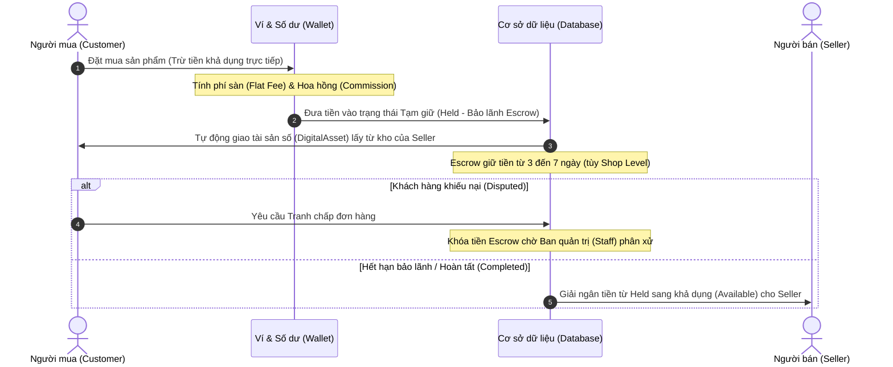

# Đặc tả Kỹ thuật Chức năng Đơn hàng (Order Feature Specification)

Tài liệu này mô tả chi tiết kiến trúc Technical Design (cả Frontend và Backend) của chức năng Đơn hàng (mua bán sản phẩm số C2C, bảo lãnh ví Escrow và giao nhận tài khoản/key tự động) trong hệ thống MMO Market.

---

## 1. Tổng quan Nghiệp vụ (Business Flow)

Quy trình mua hàng và xử lý đơn hàng diễn ra qua các bước sau:

---

## 2. Kiến trúc Backend (Backend Architecture)

### 2.1. Thực thể Cơ sở dữ liệu (Database Entities)

Chức năng đơn hàng được quản lý chính qua hai bảng:

#### Bảng `Transactions` (Đơn hàng)
Ánh xạ qua lớp Java [Transaction.java](file:///d:/FPT/SU26/SWP391/mmo-system/MMO_Market/MMO_Market%20%283%29/MMO_Market/apps/backend/src/main/java/com/mmo/shared/model/Transaction.java):
*   `id` (BIGINT): Khóa chính tự tăng.
*   `customer_id` (BIGINT): FK liên kết tới người mua (`User`).
*   `seller_id` (BIGINT): FK liên kết tới người bán (`User`).
*   `product_id` & `variant_id` (BIGINT): FK liên kết tới sản phẩm và biến thể được mua.
*   `amount_vnd` (BIGINT): Giá gốc của đơn hàng.
*   `commission_vnd` (BIGINT): Phí hoa hồng sàn thu từ đơn hàng (tự động tính dựa trên tỉ lệ cấu hình).
*   `status` (VARCHAR): Trạng thái đơn hàng (`Held`, `Completed`, `Refunded`, `Cancelled`, `Disputed`). Mặc định khởi tạo là `Held` (Tạm giữ bảo lãnh).
*   `escrow_release_date` (DATETIME): Thời điểm tự động giải ngân tiền cho người bán.
*   `quantity` (INT): Số lượng sản phẩm mua.

#### Bảng `DigitalAssets` (Kho hàng & Tài sản số bàn giao)
Ánh xạ qua lớp Java [DigitalAsset.java](file:///d:/FPT/SU26/SWP391/mmo-system/MMO_Market/MMO_Market%20%283%29/MMO_Market/apps/backend/src/main/java/com/mmo/shared/model/DigitalAsset.java):
*   `id` (BIGINT): Khóa chính.
*   `variant_id` (BIGINT): Biến thể sản phẩm.
*   `transaction_id` (BIGINT): FK liên kết tới đơn hàng sau khi được bán.
*   `asset_type` (VARCHAR): Loại tài sản (`ACCOUNT` | `KEY` | `GAME_CARD`).
*   `account_username` & `account_password`: Thông tin tài khoản/mật khẩu đăng nhập.
*   `key_code` & `card_code` / `card_pin`: Mã key bản quyền hoặc mã thẻ game.
*   `is_used` (BIT): Đánh dấu trạng thái đã bán (`true`) hay còn trong kho (`false`).

---

### 2.2. Xử lý logic tại Service (`TransactionService.java`)

Hàm [purchaseProduct](file:///d:/FPT/SU26/SWP391/mmo-system/MMO_Market/MMO_Market%20%283%29/MMO_Market/apps/backend/src/main/java/com/mmo/feature/order/service/TransactionService.java#L48-L200) thực hiện các bước:
1.  **Kiểm tra điều kiện mua:** Xác định người mua, sản phẩm, và cửa hàng người bán hoạt động bình thường (không bị khóa/tạm ngưng).
2.  **Kiểm tra tồn kho:** Xác minh số lượng sản phẩm số (`DigitalAsset`) còn trong kho lớn hơn hoặc bằng số lượng yêu cầu mua.
3.  **Thanh toán ví:** Tính tổng tiền cần trả (bao gồm giá sản phẩm và phí cố định mua `FLAT_BUYER_FEE_VND`). Khấu trừ trực tiếp số dư khả dụng (`balanceVnd`) của khách hàng ngay tại thời điểm thanh toán.
4.  **Thiết lập Escrow động:** Tính toán số giờ giam tiền bảo lãnh (`escrowHoldHours`) dựa trên cấp độ uy tín của Shop (`ShopLevel`):
    *   *Shop Level 0 hoặc Level 1:* Thời gian giam quỹ là **168 giờ (7 ngày)** để bảo vệ người mua tối đa.
    *   *Shop Level 2 (Đã có độ uy tín cao):* Thời gian giam quỹ mặc định là **72 giờ (3 ngày)**.
5.  **Bàn giao tài sản số:** Cập nhật trạng thái `isUsed = true` cho các `DigitalAsset` tương ứng trong kho và gán khóa `transaction_id`.

---

### 2.3. Cổng API Controller (`TransactionController.java`)

Lớp [TransactionController.java](file:///d:/FPT/SU26/SWP391/mmo-system/MMO_Market/MMO_Market%20%283%29/MMO_Market/apps/backend/src/main/java/com/mmo/feature/order/controller/TransactionController.java) cung cấp các endpoint:
*   `POST /api/orders/purchase`: Thực hiện thanh toán và mua hàng.
*   `GET /api/orders/me`: Lấy danh sách các đơn hàng của khách hàng hiện tại (trả về danh sách `OrderDto`).
*   `GET /api/orders/{id}`: Trả về chi tiết của một đơn hàng, đính kèm thông tin bảo mật của tất cả sản phẩm số đã mua thông qua danh sách `credentialsList`.

---

## 3. Kiến trúc Frontend (Frontend Architecture)

### 3.1. Các trang giao diện (Thymeleaf Templates)

*   [orders.html](file:///d:/FPT/SU26/SWP391/mmo-system/MMO_Market/MMO_Market%20%283%29/MMO_Market/apps/frontend/templates/account/orders.html) (Trang danh sách đơn hàng):
    *   Chứa bộ lọc tìm kiếm theo mã đơn, sản phẩm và trạng thái thanh toán (đã thanh toán, thất bại, đã hoàn tiền).
    *   *Lưu ý:* Trạng thái "Chờ thanh toán" đã bị xóa hoàn toàn khỏi bộ lọc do hệ thống áp dụng luồng trừ tiền trực tiếp trên ví ngay lập tức.
*   [order-detail.html](file:///d:/FPT/SU26/SWP391/mmo-system/MMO_Market/MMO_Market%20%283%29/MMO_Market/apps/frontend/templates/account/order-detail.html) (Trang chi tiết đơn hàng):
    *   Áp dụng mô hình **Single Card Layout** gộp toàn bộ thông tin (Metadata đơn hàng, Trạng thái thanh toán, Thông tin tài sản số đã mua, và Nút thao tác xử lý) vào một Card duy nhất (`grid-column: 1 / -1`) căng rộng toàn màn hình.
    *   Hiển thị dòng tiến trình xử lý ngang (Timeline) lên trên cùng nhằm tối ưu hóa trải nghiệm khách hàng.

---

### 3.2. Logic Điều hướng & Bảo mật (`account-order-detail.js`)

Tệp mã nguồn [account-order-detail.js](file:///d:/FPT/SU26/SWP391/mmo-system/MMO_Market/MMO_Market%20%283%29/MMO_Market/apps/frontend/static/js/customer/account-order-detail.js) xử lý các tính năng bảo mật:

#### 1. Ẩn/Hiện thông tin tài sản đã mua (Masking & Toggle):
*   Khi tải trang, các trường thông tin quan trọng (`username`, `password`, `key`) sẽ được hiển thị bằng chuỗi ký tự ẩn cố định là `••••••••••••`.
*   Biểu tượng con mắt (`fa-eye` / `fa-eye-slash`) được tích hợp cạnh mỗi trường thông tin. Khi nhấn, hàm `toggleCredVisibility` sẽ hoán đổi văn bản hiển thị giữa giá trị thật và chuỗi che giấu.
*   **Ngăn chặn con mắt mặc định của trình duyệt:** Hệ thống sử dụng thẻ văn bản thuần `<code>` thay vì thẻ `<input type="password">`. Điều này đảm bảo các trình duyệt web (như Edge, Chrome, Safari) không tự động chèn biểu tượng con mắt riêng của họ lên giao diện, đảm bảo tính đồng bộ tối đa cho thiết kế của hệ thống.

#### 2. Hỗ trợ mua nhiều sản phẩm (Multiple Credentials):
*   Hàm `createAccessInfo` phân tích mảng `order.credentialsList`.
*   Nếu số lượng sản phẩm lớn hơn 1, hệ thống sẽ tự động tạo ra nhiều khung thẻ riêng biệt (được đánh số thứ tự như `#1`, `#2`...).
*   Mỗi thẻ sử dụng định danh ID duy nhất (ví dụ: `credUsername_0`, `credUsername_1`...) để hỗ trợ thao tác sao chép (Copy) và Ẩn/Hiện độc lập cho từng tài khoản.

---

## 4. Cơ chế An toàn & Phòng chống Gian lận (Anti-Fraud Features)

*   **Không có đơn hàng nợ (Immediate Debit):** Loại bỏ hoàn toàn khả năng người mua tạo đơn hàng ảo giữ chỗ mà không trả tiền. Trạng thái thanh toán mặc định khi đơn tạo thành công là `PAID` (Đã thanh toán) và số dư ví bị trừ ngay lập tức.
*   **Tự động hóa phân phối hàng:** Việc lấy tài sản số được truy vấn và cấp phát tự động từ CSDL tại thời điểm giao dịch, triệt tiêu khả năng người bán can thiệp thủ công giao hàng giả hoặc thay đổi thông tin sau khi khách hàng đã thanh toán.
*   **Bảo mật hiển thị phía Client:** Thông tin tài khoản đăng nhập/key bản quyền không hiển thị rõ ràng trên màn hình danh sách, tránh tình trạng lộ lọt thông tin khi người dùng mở trang danh sách ở nơi công cộng.
