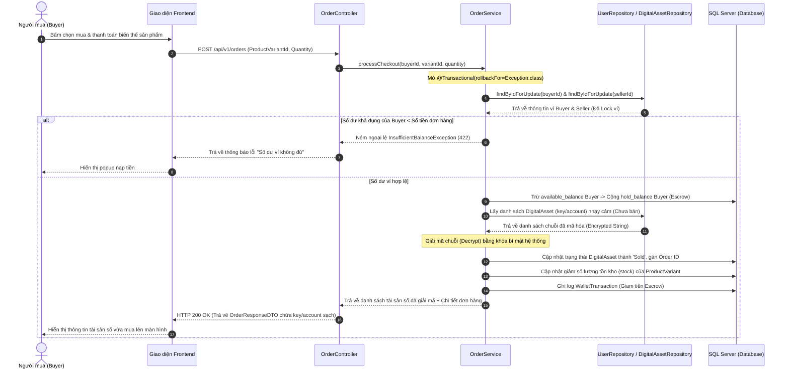
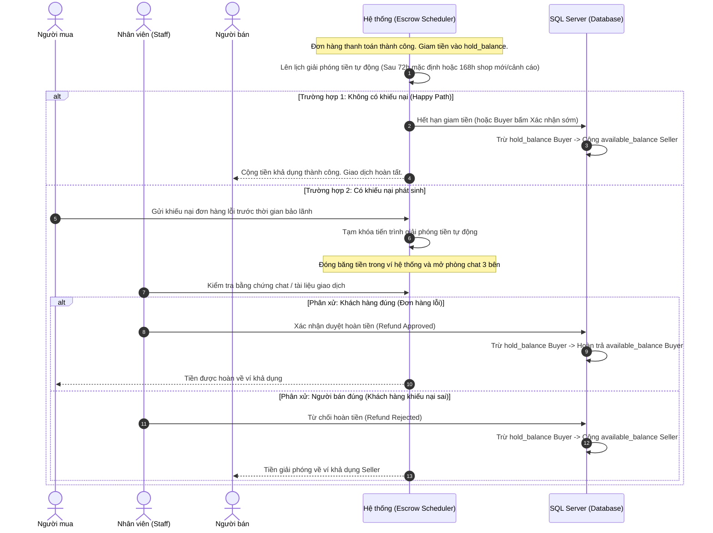
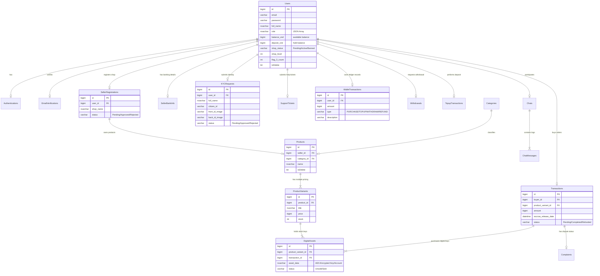

# MMO Market — System Design & Architecture

Tài liệu này đặc tả kiến trúc hệ thống, sơ đồ tuần tự nghiệp vụ cốt lõi, cấu trúc thư mục thực tế và thiết kế cơ sở dữ liệu chi tiết của dự án **MMO Market** (Sàn giao dịch sản phẩm số C2C).

---

## 1. SƠ ĐỒ KIẾN TRÚC DỰ ÁN (Architecture Diagram)

Hệ thống MMO Market được xây dựng theo kiến trúc phân tầng nguyên khối (**Monolithic 3-Layer Architecture**), phân tách rõ ràng giao diện hiển thị (Frontend) và luồng xử lý nghiệp vụ bảo mật (Backend).

### 1.1 Sơ đồ luồng xử lý Request

```mermaid
graph TD
    Client[Browser / Client] <-->|HTTP/HTTPS| FE[Frontend Portal: Thymeleaf / Static HTML, CSS, JS]
    FE <-->|REST API / JSON + Session| Gateway[Spring Security Filter Chain & JWT Verification]
    
    subgraph Spring Boot Backend (Java 17)
        Gateway <--> Controller[Controller Layer: @RestController / MVC Controllers]
        Controller <--> Service[Service Layer: Business Logic & Transactions]
        Service <--> Repository[Repository Layer: Spring Data JPA]
    end

    subgraph External & Database
        Repository <--> DB[(SQL Server DB)]
        Service <-->|Callback Webhook| SePay[Cổng nạp tiền tự động SePay]
        Service <-->|SMTP Protocol| Mail[Gmail SMTP Service]
    end
    
    DB -.->|Set-based triggers| Triggers[Database Triggers]
```

### 1.2 Phân rã Kiến trúc phân tầng Backend

1. **Controller Layer (`@RestController` / `@Controller`)**:
   - Chỉ đảm nhận tiếp nhận request, validate định dạng dữ liệu đầu vào (`@Valid`), và phân quyền sơ bộ qua `@PreAuthorize`.
   - Chuyển đổi dữ liệu và phản hồi thông qua các lớp DTO sạch sẽ.
2. **Service Layer (`@Service` / `@Transactional`)**:
   - Nơi xử lý toàn bộ logic nghiệp vụ (tính toán số dư ví, phí sàn, thời gian giam tiền, mã hóa/giải mã tài sản số).
   - Áp dụng khóa bi quan (**Pessimistic Locking**) trên ví tài khoản để tránh tranh chấp tài nguyên (Race Condition).
3. **Repository Layer (`@Repository`)**:
   - Sử dụng Spring Data JPA để giao tiếp dữ liệu. Các câu truy vấn phức tạp hoặc báo cáo được viết bằng Native SQL hoặc JPQL.
4. **Entity Layer (`@Entity`)**:
   - Ánh xạ trực tiếp 1-1 với Schema cơ sở dữ liệu SQL Server. Tích hợp xử lý cờ xóa mềm `isDelete`.

---

## 2. LUỒNG NGHIỆP VỤ & SƠ ĐỒ TUẦN TỰ (Sequence Diagrams)

### 2.1 Luồng mua hàng & Giải mã tài sản số tức thì (Instant Digital Delivery)

Nghiệp vụ mua hàng trên MMO Market yêu cầu hệ thống trừ ví Buyer, giam tiền vào Escrow, giải mã tài sản số (key/account) đã mã hóa trong database, giao trực tiếp cho Buyer và cập nhật tồn kho tức thời.



### 2.2 Luồng bảo lãnh giao dịch (Escrow Giam tiền) & Giải quyết tranh chấp

Tiền mua hàng được giam trong ví hệ thống. Thời gian giam được tính động dựa trên cảnh cáo hoặc mức độ uy tín của Shop.



---

## 3. CẤU TRÚC THƯ MỤC HỆ THỐNG (Folder Structure)

Cấu trúc mã nguồn thực tế của dự án được tổ chức rõ ràng để phân biệt giữa backend Spring Boot và giao diện Thymeleaf tĩnh:

```text
c:\Users\pc\MMO_new1\MMO_Market\MMO_Market (3)\MMO_Market\
├── docs/                             # Tài liệu đặc tả hệ thống
│   ├── specifications/               # Đặc tả phân quyền màn hình
│   │   └── screen-authorization.md   # [DOC] Quản lý phân quyền truy cập màn hình
│   └── architecture/                 # Tài liệu quy chuẩn thiết kế UI
│       └── DESIGN.md                 # [DOC] Quy chuẩn màu sắc và Toast Notification
│
├── .sdd/                             # Đặc tả thiết kế chi tiết (Specification-Driven Development)
│   ├── constraints/                  # Các ràng buộc nghiệp vụ bất biến
│   │   ├── business.md               # [MD] Ràng buộc ví, tiền tệ, escrow động
│   │   ├── global.md                 # [MD] Ràng buộc hiệu năng và bảo mật hệ thống
│   │   └── safety.md                 # [MD] Ràng buộc mã hóa tài sản và giao dịch ví
│   │
│   └── specs/                        # Đặc tả 30 Use Cases chuẩn hóa của Backend & Frontend
│       ├── features/                 # Danh sách đặc tả tính năng cấp cao (SPEC-01 đến SPEC-07)
│       │   ├── SPEC-01_AUTH.md       # [MD] Đặc tả hệ thống xác thực
│       │   ├── SPEC-02_WALLET.md     # [MD] Đặc tả mô-đun ví tiền tệ
│       │   ├── SPEC-03_SELLER.md     # [MD] Đặc tả đăng ký và cấu hình shop
│       │   ├── SPEC-04_CUSTOMER.md   # [MD] Đặc tả giỏ hàng và đặt hàng
│       │   ├── SPEC-05_STAFF.md      # [MD] Đặc tả các nghiệp vụ kiểm duyệt
│       │   ├── SPEC-06_ADMIN.md      # [MD] Đặc tả quản trị và báo cáo doanh thu
│       │   └── SPEC-07_NOTIFICATION.md # [MD] Đặc tả gửi thông báo in-app và email
│       │
│       └── backend/                  # Tài liệu 30 Use Cases chi tiết của Backend (Given-When-Then, Sequence Diagram)
│           ├── feat-admin/           # UC-28: Quản lý người dùng và khóa tài khoản
│           ├── feat-auth/            # UC-01 đến UC-06: Đăng ký, đăng nhập, đổi mật khẩu, OTP
│           ├── feat-chat/            # UC-15: Chat 3 bên khi khiếu nại
│           ├── feat-complaint/       # UC-26, UC-29: Gửi khiếu nại, giải quyết hoàn tiền
│           ├── feat-order/           # UC-12 đến UC-14: Thanh toán, giao hàng giải mã key, nhận sớm
│           ├── feat-product/         # UC-07 đến UC-09, UC-23, UC-24: Đăng sản phẩm, biến thể, search
│           ├── feat-review/          # UC-10, UC-11: Xem đánh giá và feedback sản phẩm
│           ├── feat-seller/          # UC-21, UC-22, UC-25: Yêu cầu mở shop, đổi thông tin shop, statistics
│           ├── feat-support/         # UC-27: Tạo thẻ yêu cầu hỗ trợ (Support Ticket)
│           └── feat-wallet/          # UC-16 đến UC-20, UC-30: VietQR nạp tiền, SePay callback, rút tiền
│
└── apps/                             # Mã nguồn ứng dụng
    ├── backend/                      # Mã nguồn Backend (Spring Boot, Java 17, Maven)
    │   ├── src/main/java/com/mmo/
    │   │   ├── MMOMarketApplication.java # Lớp chạy chính của ứng dụng
    │   │   ├── shared/               # Lớp tài nguyên dùng chung toàn hệ thống
    │   │   │   ├── model/            # Các thực thể JPA Entity mapping với DB
    │   │   │   ├── dal/              # Các interface Repository truy xuất DB (JPA)
    │   │   │   ├── security/         # Bộ lọc JWT, cấu hình Spring Security
    │   │   │   ├── config/           # Cấu hình hệ thống (WebConfig, JpaConfig)
    │   │   │   └── dto/              # Lớp truyền tải dữ liệu chung (DTO Request/Response)
    │   │   └── feature/              # Các lát cắt nghiệp vụ (Feature Modules)
    │   │       ├── auth/             # Xác thực tài khoản, đăng ký, đăng nhập, OTP, đổi mật khẩu
    │   │       ├── kyc/              # Hồ sơ định danh khách hàng (KYC)
    │   │       ├── seller/           # Hồ sơ đăng ký shop, thông tin shop, seller console
    │   │       ├── product/          # Hiển thị sản phẩm, danh mục, đánh giá, cắm cờ cảnh báo
    │   │       ├── wallet/           # Ví tài chính, nạp tiền (SePay), rút tiền ngân hàng
    │   │       ├── order/            # Giỏ hàng, tạo đơn hàng và thanh toán bảo lãnh
    │   │       ├── preorder/         # Logic đặt hàng trước sản phẩm số
    │   │       ├── complaint/        # Quản lý khiếu nại tranh chấp giao dịch
    │   │       ├── support/          # Hệ thống tiếp nhận thẻ yêu cầu hỗ trợ (Support Ticket)
    │   │       ├── chat/             # Nhắn tin thời gian thực giữa các bên
    │   │       ├── notification/     # Quản lý thông báo in-app và gửi email tự động
    │   │       ├── staff/            # Các chức năng kiểm duyệt chuyên biệt của Nhân viên
    │   │       └── upload/           # Xử lý tải ảnh tải tệp tin đính kèm lên máy chủ
    │   └── src/main/resources/       # Tệp cấu hình Spring Boot (application.properties)
    │
    └── frontend/                     # Mã nguồn Frontend (Giao diện hiển thị)
        ├── templates/                # Tệp HTML Thymeleaf
        │   ├── account/              # Màn hình ví, lịch sử giao dịch, đơn mua của Customer
        │   ├── admin/                # Bảng điều khiển cấu hình hệ thống và doanh thu của Admin
        │   ├── auth/                 # Trang đăng nhập, đăng ký, OTP
        │   ├── fragments/            # Các mảnh giao diện tái sử dụng (header, footer, sidebars)
        │   ├── seller/               # Giao diện quản lý bán hàng của Seller
        │   ├── staff/                # Giao diện kiểm duyệt hồ sơ, nạp rút, khiếu nại của Staff
        │   ├── home.html             # Trang chủ hệ thống
        │   └── messages.html         # Trang chat trực tiếp
        └── static/                   # Tài sản tĩnh
            ├── css/                  # Các file style CSS thuần tương ứng theo module
            └── js/                   # Thư viện JavaScript gọi REST API và render giao diện động
```

---

## 4. SƠ ĐỒ THỰC THỂ QUAN HỆ CSDL (ERD - Database Design)

Cơ sở dữ liệu của hệ thống được quản lý trên SQL Server với quan hệ thực thể chặt chẽ để đảm bảo tính toàn vẹn dữ liệu tài chính.



---

## 5. CÁC QUYẾT ĐỊNH KỸ THUẬT CHÍNH (Technical Core Patterns)

### 5.1 Xử lý phân chia số dư ví an toàn
Hệ thống lưu trữ ví của người dùng trực tiếp trong thực thể `Users`:
- `balance_vnd` (Số dư khả dụng): Tiền thực tế có thể dùng để thanh toán mua hàng hoặc tạo lệnh rút tiền.
- `deposit_vnd` (Số dư đóng băng): Số tiền bị giam giữ tạm thời khi có giao dịch mua hàng chưa hết hạn bảo lãnh (Escrow), hoặc lệnh rút tiền ngân hàng đang chờ phê duyệt từ Staff.
- **Race Condition Safeguard**: Mọi thao tác cập nhật ví tài chính bắt buộc phải dùng `@Transactional(rollbackFor = Exception.class)` và thực hiện khóa bi quan qua câu truy vấn JPA có chứa gợi ý khóa (locking hint) để tránh việc hai tiến trình trừ tiền song song dẫn đến số dư bị âm hoặc sai lệch.

### 5.2 Mã hóa dữ liệu tài sản số nhạy cảm (Digital Assets Encryption)
Để chống rò rỉ dữ liệu khi có sự cố tấn công cơ sở dữ liệu, thông tin nhạy cảm của sản phẩm số (chứa trong trường `asset_data` của bảng `DigitalAssets` như tài khoản đăng nhập, giftcode, key kích hoạt) bắt buộc phải được mã hóa trước khi ghi vào cơ sở dữ liệu:
- **Thuật toán**: Sử dụng mã hóa đối xứng AES-256.
- **Secret Key**: Được nạp động thông qua Environment Variables của hệ điều hành phía Backend server, tuyệt đối không lưu cứng trong mã nguồn dự án.
- **Thời điểm giải mã**: Việc giải mã chỉ diễn ra trên bộ nhớ tạm (In-Memory) ngay tại thời điểm giao dịch mua hàng thành công để trả về giao hàng tức thì cho Client.

### 5.3 Trigger Database Set-based chuyên biệt
Hệ thống tận dụng Trigger của SQL Server để tự động hóa các nghiệp vụ ràng buộc dữ liệu lớn như ghi nhật ký kiểm định, tự động tăng chỉ số phạt hoặc khóa tài khoản khi Shop bị cắm cờ vi phạm quá giới hạn:
- **Nguyên tắc**: Tuyệt đối không dùng vòng lặp tuần tự từng dòng (Cursor) gây nghẽn cổ chai DB.
- **Thiết kế**: Trigger phải xử lý song song dựa trên tập hợp dòng dữ liệu (Set-based) thông qua các bảng ảo hệ thống `inserted` và `deleted`.

### 5.4 Cấu hình an toàn đường dẫn và Thymeleaf SpEL
Để thuận tiện cho quá trình phát triển cục bộ và hot-reload giao diện, đường dẫn thư mục tài nguyên tĩnh và templates được cấu hình động tương ứng với ổ đĩa làm việc cục bộ:
- Cấu hình template path linh hoạt trỏ về thư mục làm việc thực tế ở ổ `C`:
  `spring.thymeleaf.prefix=file:///c:/Users/pc/MMO_new1/MMO_Market/MMO_Market (3)/MMO_Market/apps/frontend/templates/`
- Tránh lỗi ném ngoại lệ kiểu dữ liệu SpEL khi các tham số phân quyền hoặc view seller chưa được nạp (trị số `null`) bằng cách so sánh logic tường minh:
  `${isSellerView == true ? ...}` thay vì viết tắt để tránh crash giao diện sang trang lỗi 500.

---

## 6. TÍCH HỢP NGOẠI VI (External Integrations)

### 6.1 Tích hợp Cổng thanh toán tự động SePay
- **Mục đích**: Tự động hóa quá trình nạp tiền vào ví của người dùng mà không cần nhân viên duyệt thủ công.
- **Cơ chế**:
  1. Khi người dùng tạo yêu cầu nạp tiền (`Topup`), hệ thống sinh mã QR thanh toán chứa nội dung chuyển khoản định danh duy nhất (ví dụ: `MMOMARKET NAP 12345`).
  2. Người dùng thực hiện quét mã và thanh toán qua ứng dụng ngân hàng.
  3. SePay nhận thông báo biến động số dư tài khoản ngân hàng của hệ thống và gửi yêu cầu Callback (HTTP POST Webhook) chứa chi tiết giao dịch về Backend API.
  4. Backend xác thực chữ ký bảo mật của Webhook, đối chiếu nội dung chuyển khoản để định danh User, tự động cộng tiền khả dụng (`balance_vnd`) và lưu lại lịch sử `TopupTransactions`.

### 6.2 Gmail SMTP (Gửi OTP và Thông báo hệ thống)
- **Mục đích**: Gửi mã OTP xác thực đăng ký tài khoản, đặt lại mật khẩu và thông báo biến động số dư ví khi có giao dịch nạp/rút tiền thành công.
- **Cơ chế**: Backend tích hợp `spring-boot-starter-mail` để gửi thư bất đồng bộ thông qua cổng bảo mật SMTP của Google Mail Service.
